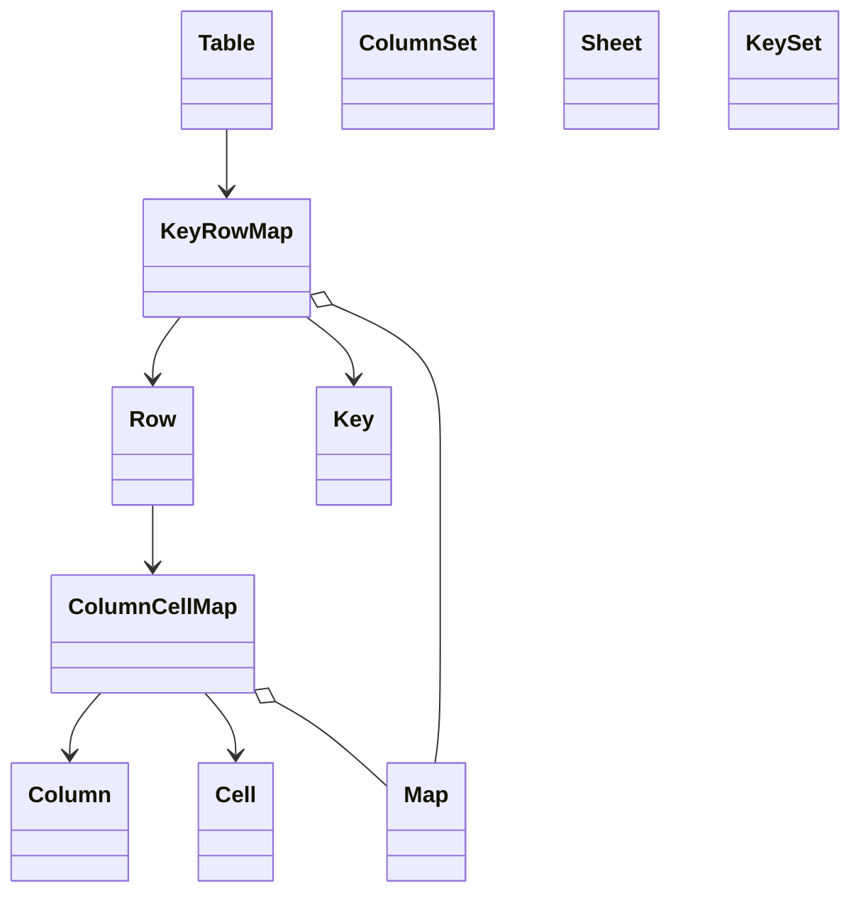
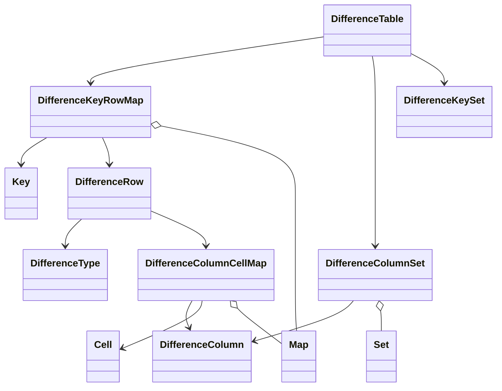
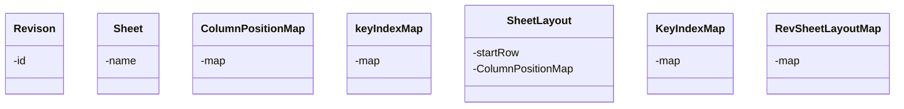
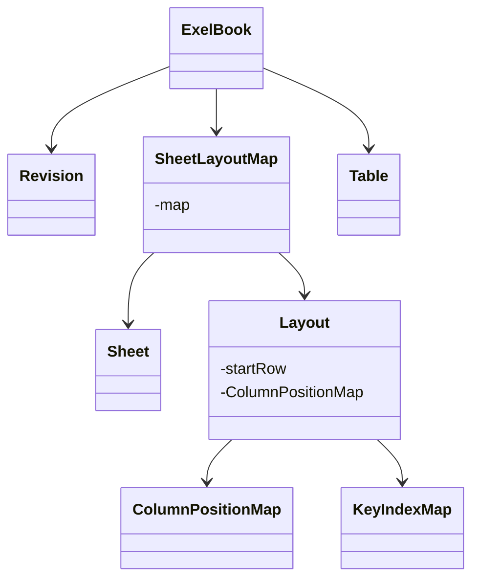
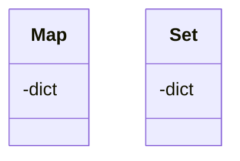

# openStorage
openStorage

# exel差分ツール

Done: No

- 下書き
    
    # 背景
    
    - 仕事でexleの差分を、アークアップするマクロの作成を頼まれた
        - n番煎じ
    - ms公式のアドインがある
        - https://note.com/bunsekiya_tech/n/n294889955454
    - しかし、職場の都合でアドインが使えない
    - vbaで実装することになった
    - 完成品イメージ
        - マクロ内蔵exelのシートにパスを入力して、ボタンを押す
        - 新ファイル側に差分箇所をマークアップして保存
        
        | new path | c://hogehoge/new_book.exsl |  |
        | --- | --- | --- |
        | old path | c://hogehoge/old_book.exsl |  |
        | run(button) |  |  |
    
    # 仕様
    
    ## exelシートの構造
    
    - シート構造イメージ
        
        
        
    - 行・列ともに構造が異なる仕様書
        - 列構造の差異
            - 仕様書にリビジョン(バージョン)がある
            - リビジョンごとに存在するカラムが異なる
                - 旧にあって新に無い、その逆も
        - 行の挿入
            - 「行の挿入」で新たなレコード・インスタンスの追加をする
                - 単純に同じ行の比較をするだけではダメ
        - 表の開始行も異なる
            - シート上部に諸情報がある
            - その下から、表が始まる
                - リビジョンごとに異なる
        - シート名は揃っているということにする
    - 新サンプル（中身の構造を適当に考えて）
    
    | カテゴリー | 機能 |  |
    | --- | --- | --- |
    |  |  |  |
    |  |  |  |
    |  |  |  |
    - 旧サンプル（こっちも）
    
    |  |  |  |
    | --- | --- | --- |
    |  |  |  |
    |  |  |  |
    |  |  |  |
    
    ## 差分検知要件・アルゴリズム例
    
    - カラムの対応付け(カラムマッピング)
        - 同じカラムでもリビジョンによってシート上の座標が異なる
            - 「カテゴリ」カラムが旧リビジョンではC列, 新リビジョンではD列
            - 設定シートを作り、座標を記入してもらうことにした
            - 表の開始行も
                
                
                | リビジョン | 開始行 | カテゴリ | … |
                | --- | --- | --- | --- |
                | 1 | 13 | C |  |
                | 2 | 15 | D |  |
    
    - 行のズレ対応付け
        - いくつかのカラムの値とシート名を組み合わせたキー(ID)を作る
        - それを突き合わせて比較をする
            - あるキーについて
                - 旧にあって、新にない
                    - 削除
                - 旧に無くて、新にある
                    - 追加
                - 旧にあって、新にもある
                    - 各セルの値を比較
                        - 差がある
                            - 変更
    
    - 差分検知アルゴリズムイメージ
        
        ```python
        # 新exelデータ, 旧exelデータ読み込み
        
        差分検知対象シートリスト = str[]
        
        for 対象シート名 in 差分検知対象シートリスト:
        	新データキー = [{ 
        		"|".join([対象シート名, 行.カテゴリ, 行.その他キーカラム]) : 行データ
        										} for 行 in 新exelデータ.表データ]
        	
        	#旧データも、
        	
        	# 比較
        	 # 追加、削除、変更の３種
        ```
        
        - 他にも、バリデーションロジックなど必要
        - 手続き型でのvba実装例
            - 後述でOOPっぽい設計の導入
            - お急ぎの方はこちらを利用
            
            ```python
            
            ```
            
    
    ## 機能
    
    - バリデーション
        - カラムマッピングの設定シート記入漏れ
        - ファイルの存在
        - 比較対象シートの存在
        - 表データの存在
        - etc
    
    - 差分検知
        - 上記のロジックで実装
    
    - マークアップ
        - 差分箇所について新データをマークアップ
    
    # 設計
    
    - VBAでもOOP的な設計・実装が可能
    - どのようなクラスが必要になるかを
    
    ## データモデル
    
    - セルクラス
        - 各セルのデータ(カラム、値)を持ったデータクラス
    
    - 行クラス
        - セルクラスの配列を持つ
        - キーも持つ
    
    - 表クラス
        - 行クラスの配列を持つ
        - その他諸情報、シート名も持つ
    
    - カラムクラス
        - 各カラムことにクラスを作る
            - キーを構成するクラスかが分かる真偽値を持つ
    
    - カラム集合
        - 利用するカラムの集合
        - 表についてリビジョンごとにカラムが異なる
            - そのリビジョンで利用されるカラムを持つ
        - 継承先
            - 表カラム集合
                - 表クラスで利用するカラム集合
                    - 新旧の各差分検知対象シートごとに作る
            - 比較対象カラム集合
                - 新旧でのカラムの和集合
                    - リビジョンが違うと、それぞれが持つカラムが異なる
                    - 比較ロジックで必要
    
    - キー
        - 各行のキー(ID)
            - 行データ(セルクラスの配列)を受け取り、キーを構築
    
    - 差分データモデル
        - 差分を表す
            - 変更の種類と変更内容を持つ
                - 種類 : 追加・削除・変更
                - 変更内容 : 変更カラムと変更後の値も持つセルクラス
                - そのセルクラスを束ねた差分集合(行・表)クラスをつくる
    
    ## ビジネスロジック
    
    - バリデーション
        - 上記のロジックの実装
    
    - 差分検知
        - 上記のロジックとデータクラスから差分検知
        - 差分データモデルを作る
    
    - マークアップ
        - 差分モデルをexelデータに適応
    
    ## その他
    
    - アダプタ
        - 物理的データを扱う機能をまとめたインフラ・リポジトリ的なクラス
            - exelデータの読みだし、書き込み(マークアップ)
            - ファイルの存在確認
            - など
    
    ## UML
    
    - mermaidでクラス図を作成、大まかなクラス間の依存関係を表現して、プロパティ・メソッドは要らない
    
    ```mermaid
    
    ```
    
    # 実装例
    
    - vbaで書いて
    
    ## データモデル
    
    ## ビジネスロジック
    
    ## インフラ層
    
    # まとめ
    
    - 役に立ったら嬉しい
    - VBAの勉強になった
    - 勉強してたOOP、コード設計、アーキテクチャの知識を実践できた
    - VBAでパワポの操作もできるらしいのでやってみたい
    
- 構成
    
    # **背景（Background）**
    
    - 社内の仕様書管理では、Excelシートを**リビジョンごとに更新**して運用している。
    - シート上部にメタ情報、下部に表がある構造で、
        
        **リビジョンごとに表の開始行やカラム構造が異なる**ことが多い。
        
    - 公式の「Excel差分アドイン」（Spreadsheet Compare など）は存在するが、
        
        **社内規定によりアドインの導入が不可**。
        
    - そのため、**VBAのみで Excel の差分検知＋マークアップ機能**を実装する必要があった。
    - 比較する差分は以下の種類を含む：
        - 行の追加／削除
        - 値の変更
        - **列の追加／削除（リビジョン差で頻発）**
    - 新旧シートは同名のシートを持つ前提で、
        
        **シート名＋複数の列の値**を組み合わせて「行キー」を作る方式で比較する。
        
    - 完成イメージは：
        - VBA内蔵のExcelブックに「新・旧ファイルのパス」を入力
        - 「比較実行」ボタンを押す
        - **新ファイルの方に差分マークアップを付けて保存**する仕組み。
    - 本記事では、上記要件を
        1. 差分検知のアルゴリズム
        2. OOP的なデータモデル設計
        3. 実際のVBA実装例
            
            の順に整理して紹介する
            
    
    # 問題記述（Problem Description）
    
    ## Excel仕様書の基本構造
    
    - 多くの仕様書Excelは「上部メタ情報」＋「下部の表」で構成される
    - 表の開始行はリビジョンごとに異なる
    - シート名は新旧で基本一致する前提とする
    - 表は「カテゴリ」「機能名」といった識別的な項目のほか、
    バージョン情報・仕様値・評価用の補助情報など複数の列で構成される
    
    ### ● 新版（例：列追加・変更あり）
    
    | カテゴリー | 機能名 | バージョン | 仕様値 | 単位 | 上限値 | 下限値 | 安全係数 | 説明文 |
    | --- | --- | --- | --- | --- | --- | --- | --- | --- |
    | Powertrain | 過給圧制御 | Base | 120 | kPa | 150 | 90 | 1.2 | 過給圧制御の仕様 |
    | Powertrain | 応答特性改善 | Sport | 1.2 | s | 1.5 | 1.0 | 1.0 | 応答改善モデル |
    
    ### ● 旧版（例：列削除・順番差異あり）
    
    | カテゴリー | 機能名 | 仕様値 | 単位 | 上限値 | 下限値 | 評価方法 |
    | --- | --- | --- | --- | --- | --- | --- |
    | Powertrain | 過給圧制御 | 115 | kPa | 150 | 85 | 定常時評価 |
    | Powertrain | 燃費制御 | 0.9 | s | 1.3 | 0.8 | 応答速度試験 |
    
    ---
    
    ## 新旧で発生する構造差異
    
    - **列の追加**
        - 新版のみの列が存在（例：安全係数、説明文）
    - **列の削除**
        - 旧版のみ存在する列がある（例：評価方法）
    - **列順の変更**
        - 新旧で列の並びが大きく異なる
    - **行の追加／削除**
        - 新版にはある機能名が旧版に無いことも、その逆も起こる
    - **表の開始位置の違い**
        - 例えば旧版は13行目から表、新版は15行目から開始など
    
    ---
    
    ## 差分検知における課題点
    
    - 行番号は比較に使えない（行の挿入・削除があるため）
    - 列番号も比較に使えない（列の追加・削除・順序変更があるため）
    - 新旧表は「似た構造だが別物」として扱う必要がある
    - 行の対応を取るために複数列を組み合わせて識別する必要がある
    ※この時点では具体的なキー生成方法は説明しない
    - 列の集合は新旧で必ずしも一致しないため、
    差分判定には「列が存在しない場合」も考慮が必要
    
    - まとめると、
    - Excel仕様書はリビジョン更新で構造が大きく変わる
    - 行番号や列番号による単純比較は機能しない
    - この問題設定を踏まえて、次章でアルゴリズムを提示する

# **差分検知アルゴリズム（Algorithm Overview）**

---

## **差分検知の考え方（Concept）**

Excel仕様書は新旧で

- 行番号が変わる
- 列番号が変わる
- 列の追加・削除が起こる
- 行の追加・削除も起こる
- 並び順が保証されない

といった構造的な差異が発生する。

そのため、本アルゴリズムでは以下の原則で比較を行う。

- **行番号や列番号を使わない**
- **論理的なキー（シート名＋複数列）で行を対応付ける**
- **列名ベースで比較を行う**
- **新旧で登場したすべてのキー（行）・列を和集合として扱う**
- **対象シート一覧を for で順番に処理する**

これにより、リビジョン差分による構造の変化に強い比較が可能になる。

---

## **3.2 行の対応付け（Key-Based Matching）**

行の一致判定には、単一の列ではなく複数の列を組み合わせたキーを使用する。

キーの構成例：

- **シート名**
- **カテゴリ**
- **機能名**

キー表現：

```python
"シート名|カテゴリ|機能名"
```

この方式により、行番号や並び順が変わっても同じ行を特定できる。

作ったキーをもとに、

- 新にのみ存在 → **追加**
- 旧にのみ存在 → **削除**
- 新旧両方に存在 → **共通（値比較の対象）**

という判定ができる。

## **列の対応付け（Column Matching）**

新旧で列の増減が起こる前提のため、列は「列名」で対応付ける。

列セットは次のように作る。

```python
全列集合 = 新列集合 ∪ 旧列集合
```

和集合（∪）をとることで、

- 新にしかない列
- 旧にしかない列

もすべて比較対象として扱える。

片方の表に列が存在しない場合、その列の値は **空（None or ""）** として扱う。

## **値の比較（Cell Comparison）**

共通キーの行（新旧両方に存在する行）について、

全列集合を使って1セルずつ比較する。

- 値が同じ → **変更なし**
- 値が異なる → **変更**
- 列自体が片側にしか存在しない → **列が追加／削除されたための変更**

値の差があれば、差分モデルに「セル変更」を追加する。

---

## **差分検知アルゴリズム（疑似コード）**

```python
# 旧ファイルと新ファイルを読み込む
旧ファイル = load("old.xlsx")
新ファイル = load("new.xlsx")

# 比較対象のシート一覧(サンプル)
対象シート一覧 = ["Spec", "Control", "IO"]

for シート名 in 対象シート一覧:

    新表 = 新ファイル から シート名 の表を読み取る
    旧表 = 旧ファイル から シート名 の表を読み取る

    # --- キー → 行データ の辞書（マップ） ---
    # キー = "シート名|カテゴリ|機能名"
    新行マップ = { key(シート名, 行.カテゴリ, 行.機能名) : 行 for 行 ∈ 新表 }
    旧行マップ = { key(シート名, 行.カテゴリ, 行.機能名) : 行 for 行 ∈ 旧表 }

    # --- 全キー（和集合） ---
    全キー集合 = 新行マップ.keys() ∪ 旧行マップ.keys()

    # --- 列の和集合 ---
    新列集合 = 新表の列名一覧
    旧列集合 = 旧表の列名一覧
    全列集合 = 新列集合 ∪ 旧列集合

    # --- キーごとの比較 ---
    for k ∈ 全キー集合:

        新にある = (k ∈ 新行マップ)
        旧にある = (k ∈ 旧行マップ)

        if 新にある and (not 旧にある):
            差分モデルに「追加行」を追加する
            continue

        if 旧にある and (not 新にある):
            差分モデルに「削除行」を追加する
            continue

        # --- 共通キー：セル比較 ---
        新行 = 新行マップ[k]
        旧行 = 旧行マップ[k]

        for 列名 ∈ 全列集合:

            新値 = 新行[列名]（存在しなければ空）
            旧値 = 旧行[列名]（存在しなければ空）

            if 新値 ≠ 旧値:
                差分モデルに「セル変更」を追加する

    # このシートの全差分をまとめて後段のマークアップ処理に渡す

# 最後に、新ファイルへ差分マークアップを実行し保存する
```

- まとめると、
- 行番号や列番号ではなく、**論理キーと列名**で比較する
- 行・列の追加／削除に強い
- 和集合（∪）を活用し、新旧に登場するすべてのキーと列を比較対象にする
- 差分は「追加行」「削除行」「セル変更」に整理され、
    
    後段の差分モデル・マークアップ処理へ流れる
    

# 設計（VBAでのOOP）

## 設計方針

- **委譲（Composition）最優先**：VBAは継承が弱い。共通化は「汎用マップ（Map）」を核に委譲で表現。
- **責務の分離**：
    - **Model**（表現・不変条件）と **Service**（手続き/アルゴリズム）を分離。
    - Excelの物理操作は **Adapter** に集約（読取/書込/座標解決の境界面）。
- **マップ駆動**：
    - 行は「**Column→Cell**」の**ColumnCellMap**を“保持”。
    - 表は「**Key→Row**」の**KeyRowMap**を“保持”。
    - 差分検知は **Key の和集合（KeySet）** を走査するシンプルな外側ループ。

---

## データクラス（Model Layer）

- **Cell**
    
    単一セルの論理値（文字列/数値/空）を保持。比較は「標準化後の等価性（Trim/Case/数値化など）」で行えるようにするのが理想。
    
- **Column**
    
    列の論理名（例：「カテゴリ」「機能名」「仕様値」）。物理座標（列番号）は**ColumnMapper**が解決。
    
- **ColumnSet**（集合）
    
    その版で“比較に用いる列”の集合。新旧で異なりうる。
    
- **Row**
    
    **ColumnCellMap**を保持し、**Key**（識別子）の生成に協力する。
    
- **Table**
    
    シート単位の論理表。**KeyRowMap**を保持し、列集合（ColumnSet）や開始行などのメタも参照。
    
- **Key**
    
    `シート名 | カテゴリ | 機能名` を基本とする行識別子。構築時に **Row**（のColumnCellMap）から必要フィールドを取り出す。
    
- **DifferenceTable/Row, KeyRowMap/ColumnCelMap**
    
    差分に関するデータ。Tbaleと似た構造を持つ。
    

> 用語メモ：
> 
> - **ColumnCellMap**＝`Column → Cell` のペアマップ（行の実体）。
> - **KeyRowMap**＝`Key → Row` のペアマップ（表の実体）。
> - どちらも **PairMap<K, V>** を委譲で使う具象マップ。

---

## ビジネスロジック

- 大きく、前処処理, 比較・差分検知, マークアップの3つ

---

## 諸情報クラス

- **Config**
    
    様々な情報を持つ。
    
    版ごとの表開始行、比較対象シート名リストなど、“構造的差異”の設定を保持。
    
- **ColumnMapper**
    
    `Column（論理名）→ 物理列番号（A=1, …）` を解決。版/シートごとの差異を吸収。
    
    - 例：`カテゴリ` は旧版で `C列`、新版で `D列` → Mapperが解決して**ExcelAdapter**の読取に渡す。
    - マークアップで利用

---

## ビジネスロジック補助

- **Map<K,V>（汎用）**
    
    `Scripting.Dictionary` を内包し、**Get** や **Keys/Values** 等の定型操作を提供。
    
    - **ColumnCellMap** と **KeyRowMap** は **Map** の“利用者”（委譲）で、ドメイン意味を与える薄いラッパー。

> ColumnCellMap と CellsMap の違い
> 
> - **ColumnCellMap**：キーが **Column**（論理名）。列順が変わっても安定。
> - （もし）**CellsMap** を作るなら：キーが「物理位置（列番号）」起点のマップ。**比較用途では不向き**なので採用しない。
- Set(集合)
    
    数学の集合に相当するオブジェクト。重複を許さない複数のオブジェクトを保持する。
    
    VBAに存在しないため自作する。ただし、単一の型に限るという設計にする。
    
    `Scripting.Dictionary` を内包し、 addやexists等の定型操作を提供。
    

---

## アダプタ層（Infrastructure）

- **ExcelAdapter**
    - 副作用を伴う物理的なファイル操作を集約
    - ex. loadBook, exists, markUpなど(仮)

---

## 簡易 UML

### データモデル

- システム内で使う抽象的なオブジェクト・モデル
    - ≒ドメインオブジェクト
- テーブル(シート内の表データの論理的・OOP的設計)



- データモデル(差分検知)



### 座標マッピング

- 「論理モデル」と「物理レイアウト」を結びつけるための対応付け
    - マークアップで利用
- エクセル仕様書で各リビジョンの表構造
    - カラムと列座標の対応付け
        - カテゴリ列はリビジョン7ではC列, 8ではD列
    - キーと行の対応付け
        - あるキー(ex. someSheet|someCategory|someFunction)は新シートの20行目のデータ
    - 物理シート上の表開始行
        - シート上で表が始まるのはリビジョン7では15行目, 8では12行目
    - これを下記のような設定シートに書いておく
        - これでカラム座標対応付け、開始行がわかる
        - シート毎に必要
        - シート名も設定できるようにして物理的なシート名の差異も吸収できるようにしても良い
    
    | シート名 | someSheet |  |  |  |
    | --- | --- | --- | --- | --- |
    | リビジョン | 開始行 | カテゴリ | 機能名 | その他のカラム |
    | 7 | 15 | C | D | … |
    | 8 | 12 | D | F | … |
    - キー行対応付けはTable作成時に作成
- クラス図概要
    - Mapについては後述



- 補足解説
    - RevSheetLayoutMap
        - 各リビジョンで各シートがある
            - 多対多の関係
            - リビジョンとシートの2つの複合キーのオブジェクトを用意して対応

### 抽象データモデルx物理座標対応づけ統合

- Table/Rowなどのシステム・ドメインオブジェクトとColumnPositionMap/KeyIndexMapなどの物理的座標を表すオブジェクトをまとめるクラス



## 自作Map/Setの設計

- VBAにはMap(key/valueのオブジェクトのペア, JavaでのMapクラスのようなもの)やSet(集合型)がない
    - 自作する
    - 内部的に辞書型を利用する
    - 下記のAPIを提供
    - 委譲先では用途に応じた型定義をする
        - 追加メソッドあり


